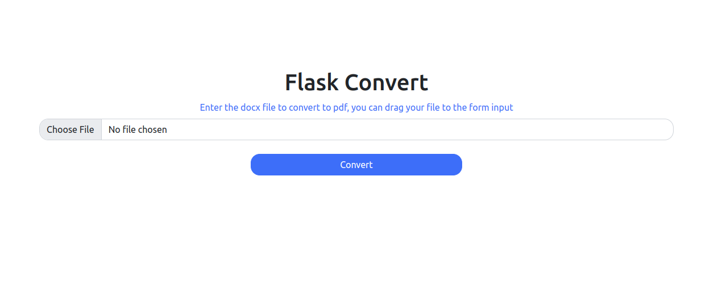

# Flask Docx To Pdf
A simple web app built with Flask that allows users to convert docx files to PDF using LibreOffice. Please note that this app only works on Linux systems.



Demo: http://47.254.252.41/

## Requirements
Python 3
\
Flask
\
Flask Toastr
\
Unoconv
\
LibreOffice
## Installation
Clone the repository: git clone https://github.com/adiyaksa1234/flask-docx-to-pdf
Navigate to the project directory: cd flask-docx-to-pdf
Install the required packages: 

```sudo apt-get install unoconv```

```pip3 install -r requirements.txt```

Run the app: python app.py
Usage
Open the app in your browser: http://localhost:5000/
Select a docx file to convert.
Click "Convert" to start the conversion process.
Once the conversion is complete, click "Download" to download the resulting PDF file.
Notes
The app stores the converted PDF files in a temp directory.
The PDF files are deleted when the app is restarted or when the user closes the browser.
The app only accepts docx files.
## Collaboration
If you would like to collaborate on this project, you can share the codebase with me and we can discuss any specific areas that you would like me to work on or provide suggestions for improvement. Additionally, we can communicate through a collaboration platform such as GitHub or through direct messaging to discuss the project and make updates to the code.
